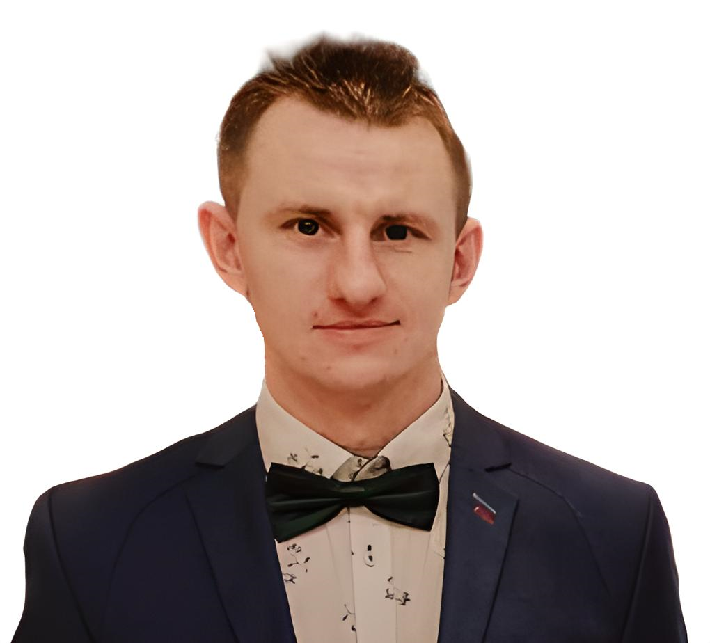

### Hi 👋 My name is Michał and I'm a Frontend Developer from Poland

## About me
Currently, I work as a CNC operator and programmer, but I'm equally passionate about the world of front-end development. I'm currently seeking my first job as a front-end developer. I completed a course at Youcode, where I had the opportunity to collaborate on a group project at the end. During the course, I learned various skills, including:

<ul>
  <li>✅ HTML | CSS | JavaScript: ES6+</li>
  <li>✅ React, including Router and Hooks</li>
  <li>✅ Redux (Toolkit), Redux-Saga</li>
  <li>✅ Working with APIs (fetch, axios)</li>
  <li>✅ Handling Promises, Async/Await</li>
  <li>✅ Media Queries</li>
  <li>✅ GitHub usage: Pull Requests & Reviews</li>
</ul>

Besides coding, I'm also working on improving my English skills because I understand they're not perfect yet. Continuous learning is important to me, and I'm committed to enhancing both my technical and language abilities. I'm eager to share my passion for technology with a new team - are you ready to embark on a programming adventure with me?"

## Tech Stack

  
  
  
  
  
  
  
  
  
  
  
  
  
  
  
  
  
  
  
  
  
  
  

## I want to learn next
<ul>
  <li>Gatsby</li>
  <li>React Context</li>
  <li>Node.js</li>
  <li>TypeScript</li>
  <li>Unit testing</li>
  <li>TanStack Query</li>
</ul>
